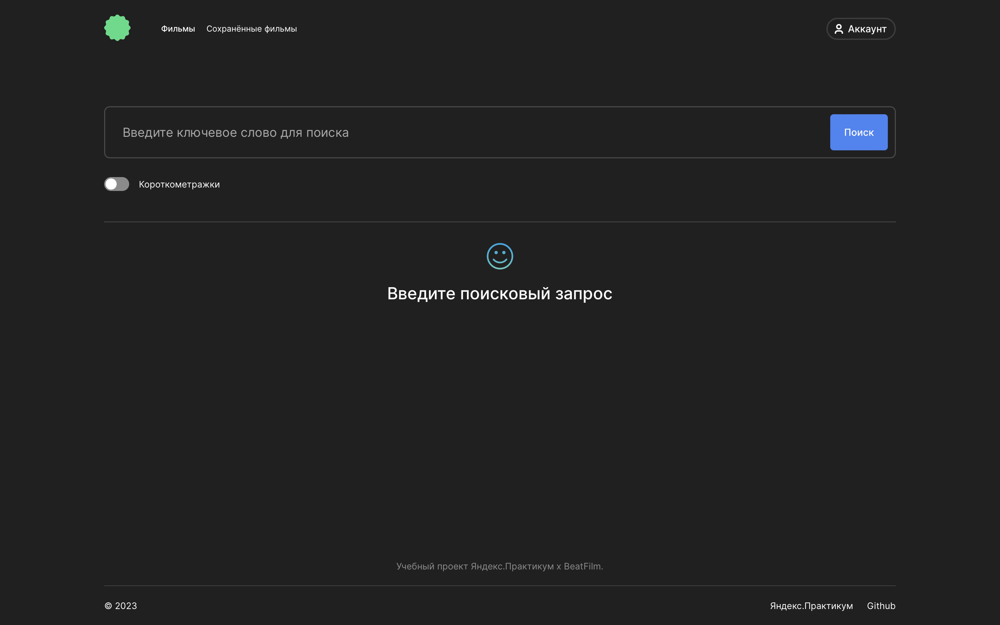

<h1 align="center" style="color:#073042" >Movies. Поиск фильмов через сервис BeatFilm</h1>

Дипломная работа в рамках обучения на Я.Практикуме

<h3 align="center"style="text-decoration:underline; font-style:italic">Описание проекта &#128444;</h3>

Проект представляет собой поисковый сервис с помощью которого можно с помощью поиска найти фильмы на стороннем ресурсе BeatFilm.

Используемые технологии

JavaScript React.js Git Express.js mongoDB HTML CSS

При первом входе пользователь попадает на главную страницу с описанием информации по созданному проекту.

Пользователю предоставляется возможность перейти на страницу регистрации или входа в правой верхней части экрана.

После успешной регистрации/авторизации, пользователь попадает на страницу поиска фильмов - необходимо ввести ключевое слово и нажать на кнопку поиск, также среди найденных фильсов можно произвести фильтрацию на короткометражные фильмы (менее 40 минут включительно), нажав на переключатель. При нажатии на фильм на новой вкладке открывается трейлер данного фильма.

Понравившиеся фильмы можно добавить в Сохраненные - поставить лайк &#128156;. Удалить фильм из любимых можно повторным нажатием на сердечко либо со страницы Сохраненные фильмы при нажатии на крестик &#10006;. На странице Сохраненные фильмы можно также произвести аналогичный поиск.

Имеется возможность изменения данных пользователя при переходе на страницу профиля - имя пользователя и его электронную почту.

<h3 align="center"style="text-decoration:underline; font-style:italic">Инструкция по развертыванию &#128212;</h3>

Хотите попробовать в использовании данный ресурс?

<ol>
 <li>Клонируйте данный репозиторий локально</li>
 <li>Клонируйте репозиторий с бэкендом - <a href="https://github.com/MariaRez/movies-explorer-api">&#128073;&#128161;</a></li>
 <li>В бэкенде на строке 32 измените порт на 3001</li>
 <li>Запустите бэкенд командой npm run dev</li>
 <li>В клонированном фронтенде в файлах /src/utils/auth.js и /src/utils/MainApi.js на 56 и 83 строках соответственно замените baseUrl на "http://localhost:3001"</li>
 <li>Запустите фронтенд командой npm run start</li>
 <li>Наслаждайтесь функционалом &#127881;</li>
</ol>
<h3 align="center"style="text-decoration:underline; font-style:italic">Планы по доработке проекта &#128221;</h3>
<ul style="list-style: square">
<li>Закрытие модальных окон при нажатии на Escape</li>
<li>Закрытие модальных окон при нажатии на клику все окна</li>
<li>Фильтрация фильмов по различным критериям - страна производства, язык фильма и другие критерии</li>
<li>Возможность добавления и изменения аватара пользователя</li>
<li>Функция восстановления пароля</li>
<li>Изменение пароля пользователя</li>
</ul>